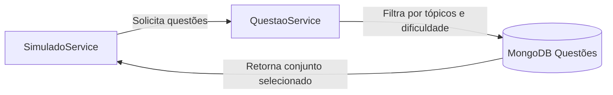

# ❓ Microserviço de Questões — BrainWin

Este serviço é responsável por **gerenciar o banco de questões** da plataforma BrainWin, incluindo criação, atualização, exclusão e recuperação de questões utilizadas nos simulados adaptativos.

Ele é consumido principalmente pelo **microserviço de Simulado**, que solicita questões conforme o nível, tópico e estrutura cognitiva de cada aluno.

---

## 🚀 Visão Geral

O microserviço de Questões provê:

✅ CRUD completo de questões  
✅ Associação a tópicos, subskills e estruturas cognitivas  
✅ Suporte à geração automática de simulados adaptativos  
✅ Retorno filtrado por dificuldade, tags e tipo de questão  
✅ Integração com o microserviço de Simulado

---

## 🔄 Fluxo Geral da Solução



---

## 🏛️ Arquitetura da Solução

- Spring Boot 3.4  
- MongoDB Atlas (Replica Set)  
- JWT (Auth)  
- API REST com validação por header `Authorization: Bearer <token>`  
- Repository Pattern com Spring Data MongoDB

📌 Tipos de comunicação:
| Componente | Consome Questões? | Para quê? |
|----------|:---:|-------------|
| Front-End | ❌ | Não acessa diretamente |
| MS Simulado | ✅ | Gera simulados adaptativos |
| MS Usuário | ❌ | Apenas referência por user_id |
| MS Perfil | ❌ | Recebe dados agregados via Simulado |

---

## ⚙️ Instalação e Configuração

### ✅ Requisitos

- Java 21+  
- Maven 3.9+  
- Conexão com MongoDB (Atlas ou local)

### 🔌 Variáveis de Ambiente / `application.properties`

```properties
spring.data.mongodb.uri=${MONGO_URI}
spring.data.mongodb.database=brainwinTest

jwt.secret=${JWT_SECRET}
jwt.expiration-ms=86400000
```

### ▶️ Executando

```sh
mvn clean package
java -jar target/questao-0.0.1-SNAPSHOT.jar
```

Servidor inicia em:  
📍 `http://localhost:8082`

---

## 📡 Principais Rotas

| Método | Rota | Autenticação | Descrição |
|--|--|--|--|
| POST | `/questoes` | ✅ | Cria nova questão |
| GET | `/questoes` | ✅ | Lista todas as questões |
| GET | `/questoes/{id}` | ✅ | Busca questão por ID |
| PUT | `/questoes/{id}` | ✅ | Atualiza questão existente |
| DELETE | `/questoes/{id}` | ADMIN | Exclui questão (somente admin) |
| POST | `/questoes/bulk` | ✅ | Cria várias questões (usado pelo Simulado) |

📝 Exemplo de criação de questão:

```json
{
  "enunciado": "Qual é o resultado de 2 + 2?",
  "alternativas": ["1", "2", "3", "4"],
  "correta": 3,
  "topico": "Matemática",
  "subskill": "Aritmética básica",
  "dificuldade": "fácil"
}
```

---

## 🧱 Estrutura do Projeto

```plaintext
ai_startup_questao/
│
├─ src/main/java/ai/startup/questaosimulado
│  ├─ auth/
│  │  └─ JwtService.java
│  │
│  ├─ security/
│  │  └─ SecurityFilter.java
│  │
│  ├─ questaosimulado/
│  │  ├─ QuestaoController.java
│  │  ├─ QuestaoService.java
│  │  ├─ QuestaoRepository.java
│  │  ├─ Questao.java
│  │  ├─ QuestaoDTO.java
│  │  ├─ QuestaoCreateDTO.java
│  │  ├─ QuestaoUpdateDTO.java
│  │
│  └─ QuestaoApplication.java
│
└─ pom.xml
```

---

## ✅ Status

| Recurso | Status |
|--------|:-----:|
| CRUD completo de questões | ✅ |
| Criação em lote (bulk) | ✅ |
| Filtro por tópico e dificuldade | ✅ |
| Integração com SimuladoService | ✅ |
| Segurança JWT | ✅ |
